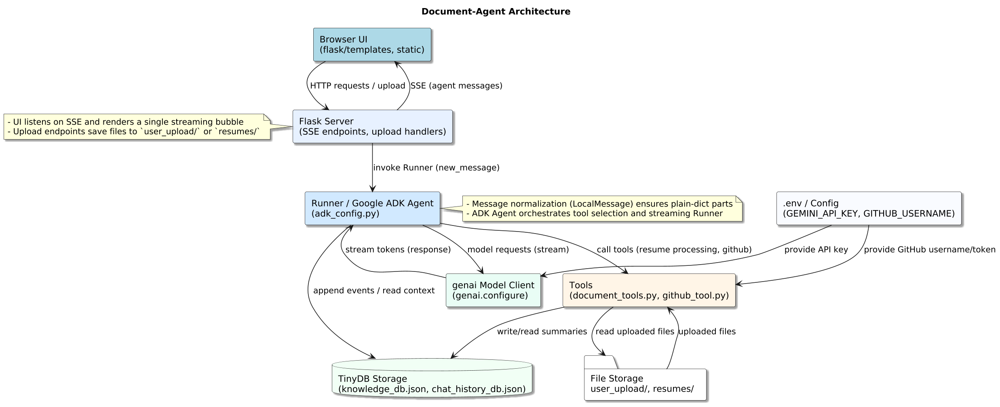

# Document Agent - Capstone Demo

Repository: https://github.com/HimanM/document-agent

**Short description**
- Document Agent is a small agent-based web demo that generates job application emails and cover letters using uploaded resumes and a user's public GitHub profile. Built after participating in Google/Kaggle "5 Days of AI" as a capstone-style personal project.

**Important note (fun)**
- This is a tiny personal project made mainly to get the participation certificate and to avoid writing the same internship emails repeatedly. It is intentionally compact and pragmatic.

## Table of contents
- Features
- Architecture
- Tech stack
- Requirements
- Setup and run (Windows PowerShell)
- Environment variables
- How to use
- Limitations
- Next steps and ideas
- Placeholders for demo images and video
- Acknowledgements and references

## Features
- Interactive chat UI (Flask + SSE) with streaming agent responses
- Drag and drop and attach-button file upload for messages
- Resume upload action (saves to `resumes/`)
- GitHub tool (uses `GITHUB_USERNAME`) to fetch public repo summaries
- TinyDB-backed session storage and simple knowledge DB for resume summaries
- Agent configured with explicit system instruction to produce plain-text emails and cover letters

## Architecture
- Frontend: `flask/templates/index.html` and `flask/static/*` (HTML, CSS, JS)
- Backend: `flask/app.py` provides SSE streaming `/api/chat`, file upload endpoints, and admin actions
- Agent config: `adk_config.py` creates the ADK agent, Runner, services, and registers tools
- Services: `services/session_service.py` (TinyDB session store) and `services/knowledge_service.py`
- Tools: `tools/github_tool.py` and `tools/document_tools.py`

### Architecture diagram
A visual diagram of the system is included below — use this in the video when you explain the high-level data flows (UI → Flask SSE → Runner/ADK → Tools & Model → TinyDB & file storage).



Talking points when showing the diagram:
- The Browser hosts the UI and listens for SSE streamed agent messages.
- Flask provides endpoints for chat and file uploads and invokes the Runner with normalized messages.
- The Runner is the ADK orchestration layer: it normalizes messages, dispatches tools (resume processor, GitHub), and streams model tokens back through the Runner to Flask.
- Tools read uploaded files and write resume summaries to the TinyDB knowledge store; the Runner also appends conversational events to the chat history TinyDB.

## Tech stack
- Python 3.x
- Flask (web UI and SSE)
- TinyDB (local JSON-backed DB for sessions and knowledge)
- Google ADK APIs (agents, runner, sessions, events) - conceptual usage in `adk_config.py`
- Google Generative AI client (`google.generativeai`) for model and file upload calls
- Frontend: vanilla HTML, CSS, JS

## Requirements
Install the required Python packages. This list is indicative; pin versions for reproducibility.
```powershell
python -m pip install flask tinydb requests python-dotenv google-generative-ai google-adk

```

## Environment variables
Create a `.env` file at the project root or set these variables in your environment:
- `GEMINI_API_KEY` - API key for the generative AI model used by `google.generativeai`
- `GITHUB_USERNAME` - optional: public GitHub username to fetch profile/repos
- `GITHUB_TOKEN` - optional: GitHub personal access token to avoid rate limits
- `DEBUG` - set to `1` to enable debug logging

## Setup and run (Windows PowerShell)
From the repository root run:
```powershell
$env:DEBUG = "1"
python d:\Projects\document-agent\flask\app.py
```
Open `http://127.0.0.1:5000/` in your browser.

## How to use
1. Start the server
2. Upload a resume via the sidebar Upload Resume button or attach files using the paperclip icon or drag files into the text composer
3. Type a request like "Write a cover letter for this job" and include a job posting file if you have one
4. The agent will consult the resume knowledge base (if processed) and the GitHub tool (if configured) and stream a plain-text cover letter in the UI

## Limitations
- Single node demo using TinyDB - not intended for production multi-user concurrency
- Model availability depends on API access and installed client versions
- GitHub tool may be rate-limited without a `GITHUB_TOKEN`
- By default only one attachment per message is supported; can be extended

## Next steps and ideas
- Automatically ingest uploaded resumes into the knowledge DB on upload
- Add multiple attachments per message
- Add progress bars for file uploads
- Persist original vs generated filenames and provide download links in the UI
- Replace TinyDB with a real database for multi-user support

## Placeholders for demo images and video
- Screenshot placeholder: ``
- Demo video placeholder: `[Watch demo video](https://your.video.url.here)`

## Acknowledgements and references
- Kaggle 5 Days of AI notebooks and exercises - https://www.kaggle.com/kaggle5daysofai
- ADK documentation - https://google.github.io/adk-docs/

